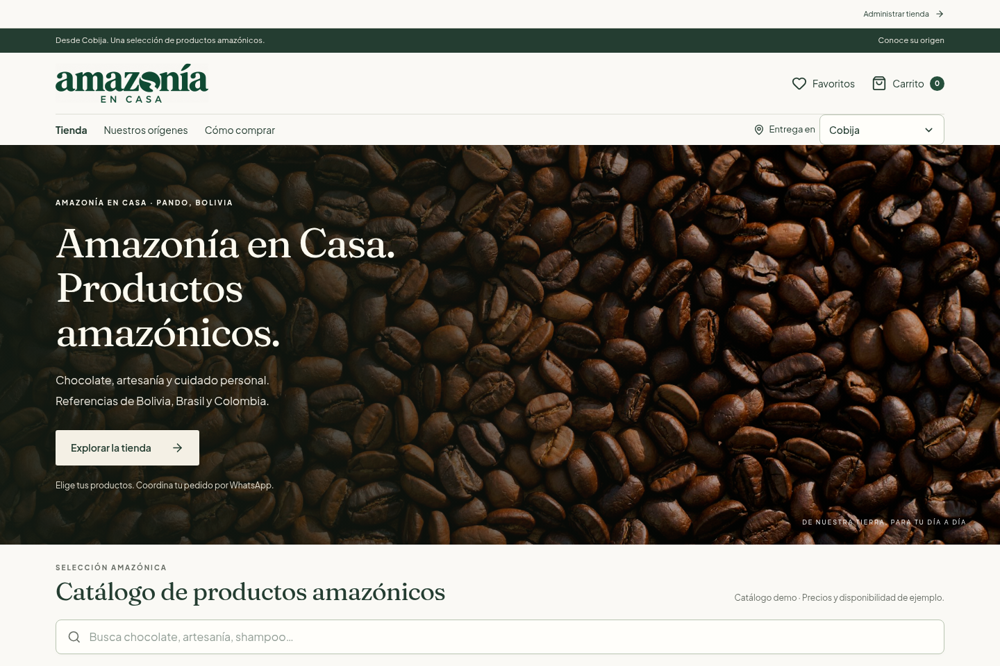
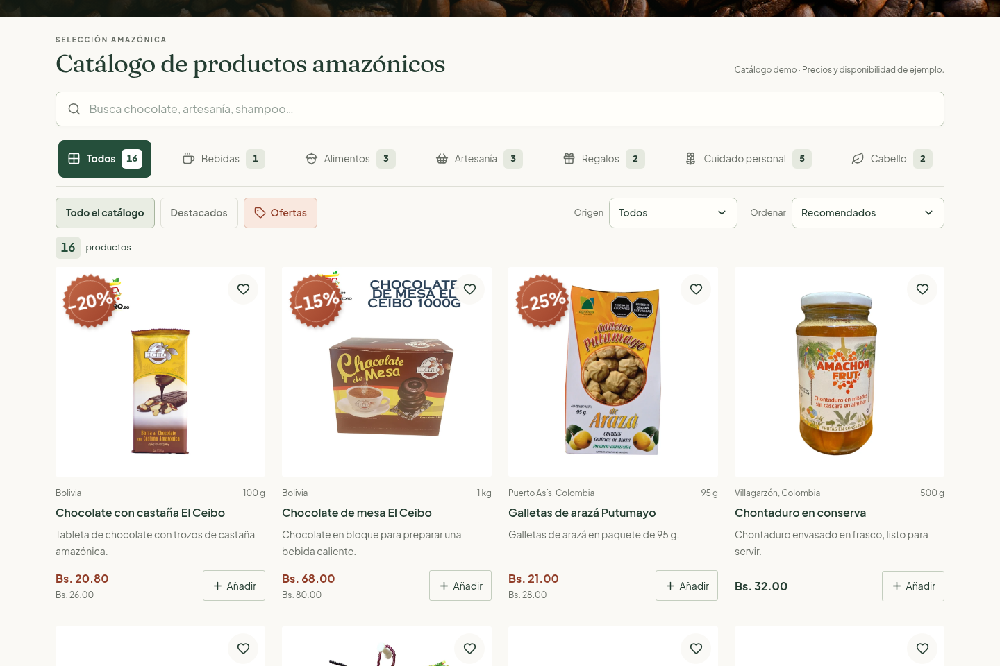
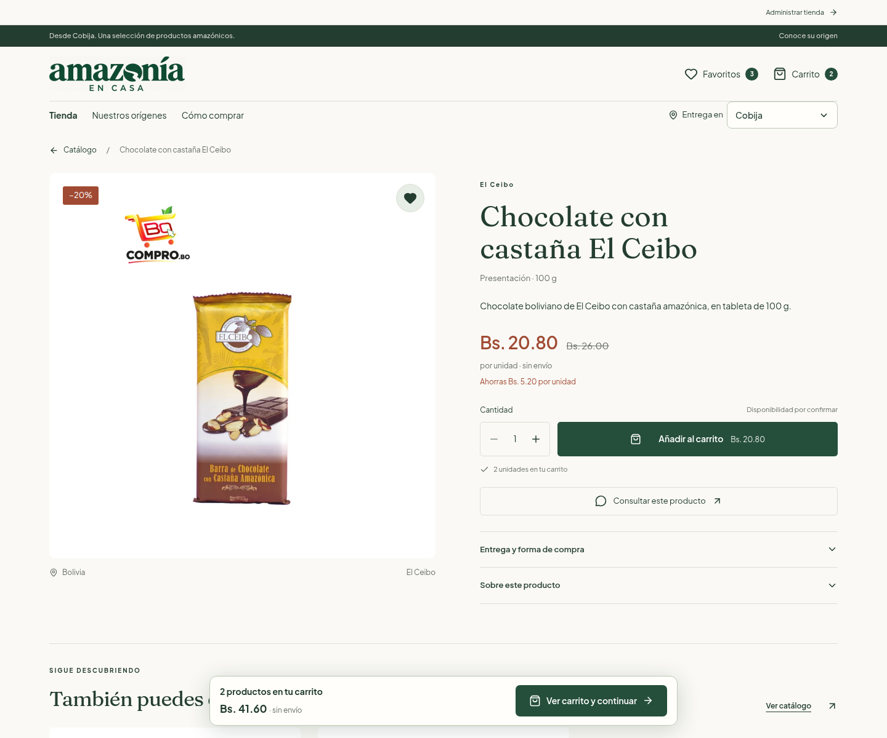
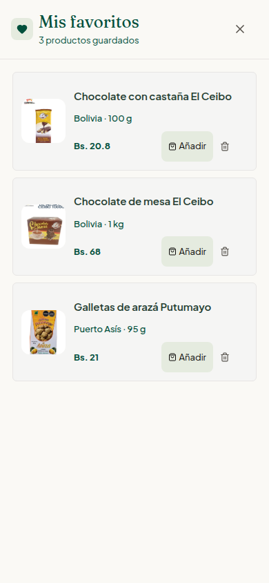
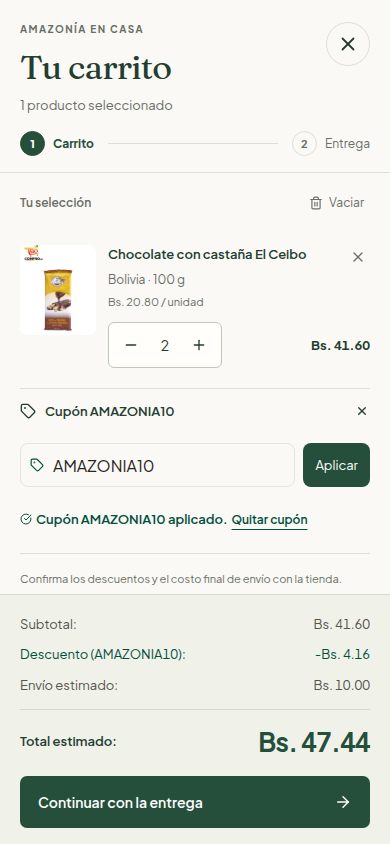
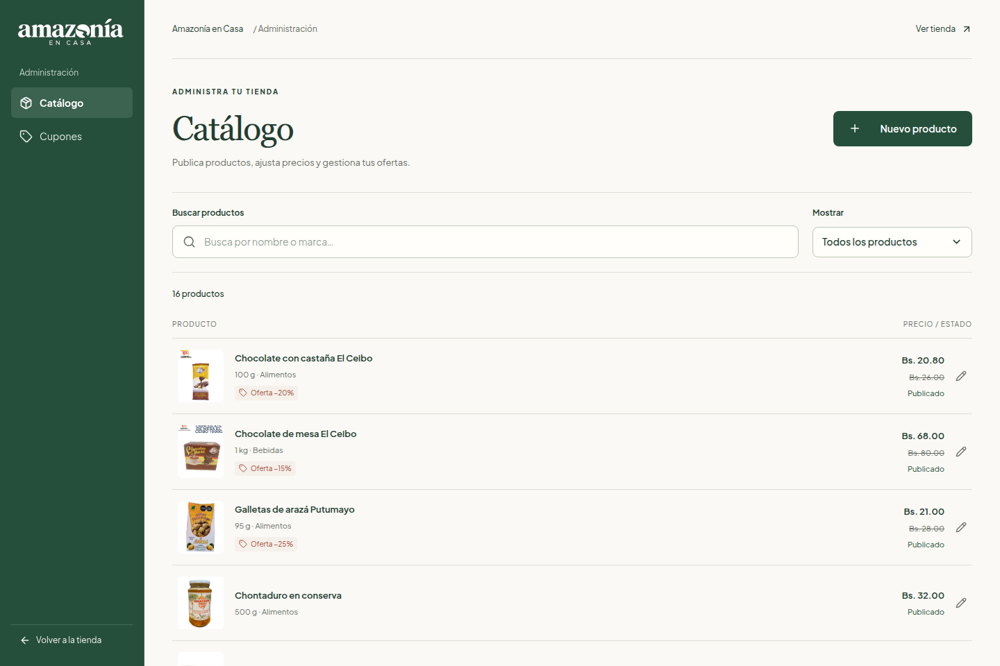
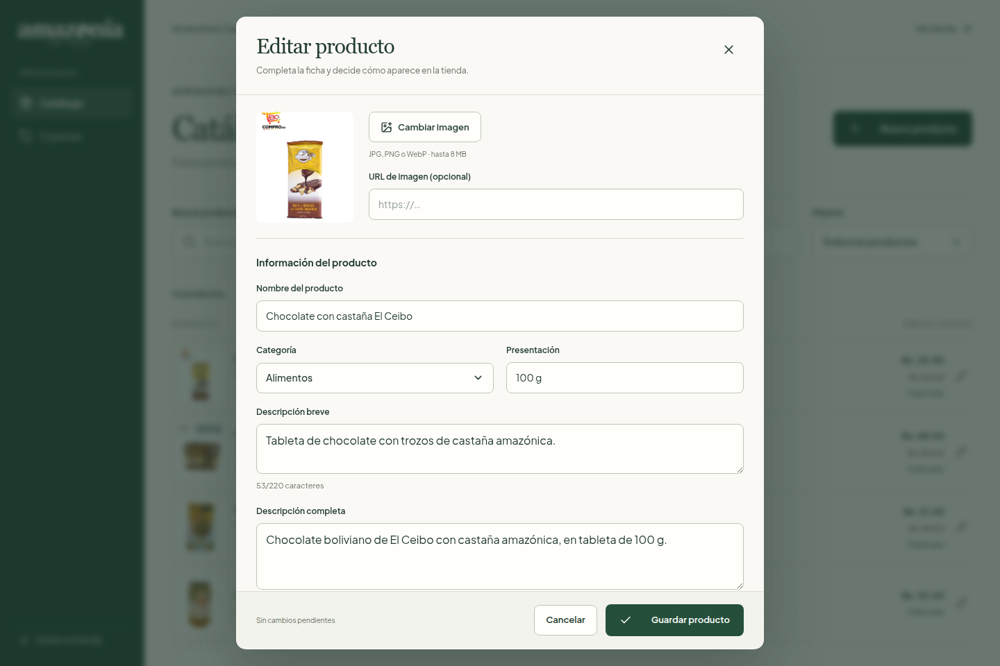
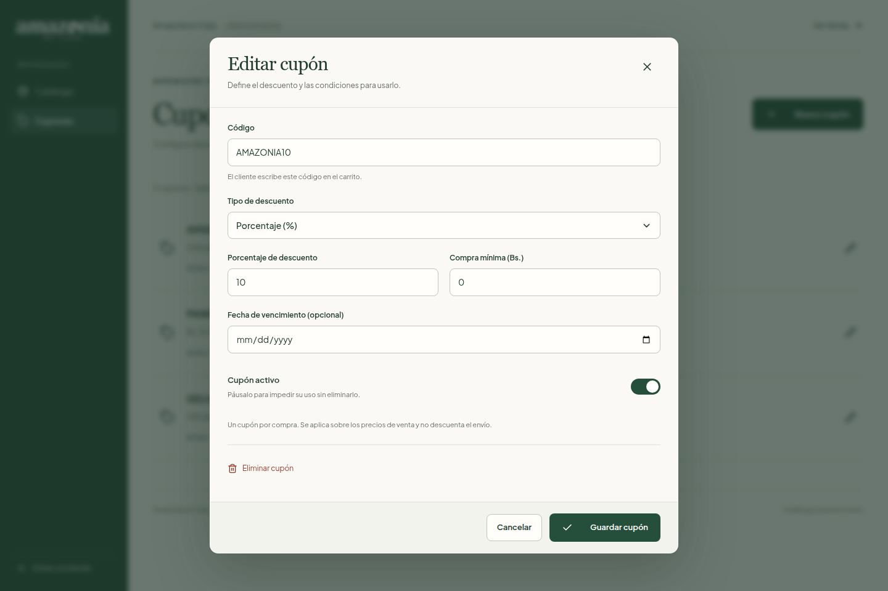

# Amazonía en Casa

Tienda web de productos amazónicos con catálogo, favoritos, carrito y solicitudes de compra por WhatsApp. Incluye un panel para administrar productos, ofertas y cupones.

**[Ver la tienda](https://luchonoprograma.github.io/amazonia-en-casa/)**



## Contenido

- [Sobre el proyecto](#sobre-el-proyecto)
- [Módulos](#módulos)
- [Instalación](#instalación)
- [Cómo probar el proyecto](#cómo-probar-el-proyecto)
- [Tecnologías](#tecnologías)
- [Estructura del código](#estructura-del-código)
- [Datos y alcance](#datos-y-alcance)

## Sobre el proyecto

Amazonía en Casa permite recorrer una selección de alimentos, artesanía y cuidado personal desde el celular o la computadora. El usuario puede consultar productos, preparar su carrito y reunir los datos necesarios para coordinar una compra por WhatsApp.

El proyecto desarrolla tanto la experiencia del comprador como la gestión del catálogo. Es una aplicación de portfolio con datos de ejemplo: funciona en el navegador, sin backend ni procesamiento de pagos.

## Módulos

### 1. Catálogo y búsqueda

El catálogo inicial contiene 16 productos. Cada tarjeta muestra fotografía, presentación, precio y acciones para añadir al carrito o guardar en favoritos.

- Búsqueda por nombre, marca y descripción, sin distinguir mayúsculas ni tildes.
- Filtros por categoría y origen, con vistas de destacados y ofertas.
- Orden por precio de menor a mayor o de mayor a menor.
- Contador de resultados y opción de restablecer filtros cuando la búsqueda queda vacía.

<details>
<summary>Ver captura del catálogo</summary>



</details>

### 2. Ficha del producto

Cada producto del catálogo inicial tiene una página propia. Se puede abrir desde una tarjeta o entrar directamente mediante su enlace.

- Fotografía, descripción, marca y presentación.
- Precio habitual, precio de oferta y ahorro cuando corresponde.
- Selector de cantidad, favoritos y acción para añadir al carrito.
- Información de entrega, productos de la misma categoría y consulta individual por WhatsApp.

<details>
<summary>Ver captura de una ficha</summary>



</details>

### 3. Favoritos y carrito

**Favoritos** reúne los productos guardados. Desde ese panel se puede consultar el detalle, añadir un producto al carrito o quitarlo de la lista.

**Carrito** permite ajustar cantidades, eliminar productos, vaciar la selección y aplicar un cupón. Muestra el subtotal, el descuento, el envío estimado y el total. Ambos módulos conservan la selección al recargar la página.

<p>
  
  
</p>

### 4. Entrega y solicitud por WhatsApp

El formulario recoge nombre, teléfono, ciudad, dirección cuando corresponde y notas adicionales. Permite elegir entrega local, recojo en tienda o envío nacional, además de indicar una preferencia de pago.

La aplicación valida los datos y prepara un mensaje con los productos, cantidades, descuentos y total estimado. Abre WhatsApp para que el usuario revise y envíe la solicitud. El resumen que aparece en la tienda no confirma una compra y el carrito se conserva.

### 5. Administración de productos y ofertas

Se accede desde **Administrar tienda**, en la parte superior de la página. El panel permite buscar por nombre o marca y filtrar productos visibles, ocultos o con oferta.

- Crear productos y editar su nombre, categoría, presentación y descripciones.
- Subir una fotografía o indicar una URL de imagen.
- Cambiar precios y activar una oferta con vista previa del descuento.
- Marcar productos como destacados, disponibles u ocultos.
- Guardar cambios o descartarlos con confirmación cuando hay una edición pendiente.



<details>
<summary>Ver el editor de productos</summary>



</details>

### 6. Administración de cupones

La sección **Cupones** permite crear y editar descuentos por porcentaje o monto fijo. Cada cupón tiene un código, una compra mínima, una fecha de vencimiento opcional y un estado activo o pausado. También puede eliminarse con confirmación.

El carrito comprueba esas condiciones antes de aplicar el descuento. Admite un cupón a la vez, sobre el subtotal de los productos; el envío no se descuenta.

<details>
<summary>Ver el editor de cupones</summary>



</details>

## Instalación

### Requisitos

- Node.js 22.
- npm y Git.

### Ejecutar en local

```bash
git clone https://github.com/LuchoNoPrograma/amazonia-en-casa.git
cd amazonia-en-casa
npm install
npm run dev
```

Abre **[localhost:3000](http://localhost:3000)**. No necesitas claves de API, una base de datos ni configurar variables de entorno para probar la aplicación.

## Cómo probar el proyecto

Este recorrido permite revisar los módulos desde la tienda publicada o la instalación local:

| Paso | Acción | Resultado esperado |
| --- | --- | --- |
| 1 | Buscar `chocolate` y cambiar de categoría. | El catálogo actualiza los productos y el contador de resultados. |
| 2 | Abrir una ficha y seleccionar dos unidades. | El importe del botón cambia según la cantidad elegida. |
| 3 | Guardar el producto en favoritos, añadirlo al carrito y recargar. | La selección y las cantidades se conservan. |
| 4 | Abrir el carrito, desplegar **¿Tienes un cupón?** y aplicar `AMAZONIA10`. | Se aplica un 10 % de descuento al subtotal con los datos iniciales. |
| 5 | Continuar con la entrega e intentar avanzar con los campos vacíos. | El formulario indica qué datos faltan. Puedes completarlos con datos ficticios para revisar el recorrido; no hace falta enviar un mensaje real. |
| 6 | Entrar en **Administrar tienda**, editar un precio y guardar. | La tienda del mismo navegador muestra el cambio. |
| 7 | Crear un cupón activo y probar su código en el carrito. | El descuento se aplica si se cumple la compra mínima. |

Las capturas de este README se tomaron de la aplicación en funcionamiento, en escritorio y móvil. Durante la comprobación del recorrido de compra se interceptó la apertura de WhatsApp, sin enviar mensajes reales.

### Comprobaciones locales

```bash
npm run lint
npm run build
npm run preview
```

`lint` comprueba los tipos de TypeScript. `build` genera la aplicación y las páginas del catálogo en `dist/`. `preview` permite revisar esa compilación en [localhost:4173](http://localhost:4173). Estos comandos complementan la prueba manual de los módulos.

## Tecnologías

| Tecnología | Uso en el proyecto |
| --- | --- |
| React y TypeScript | Componentes, estado de la tienda y tipos de productos, carrito y formularios. |
| Vite | Servidor de desarrollo y compilación. |
| React Router | Navegación entre catálogo y fichas, con historial del navegador. |
| Tailwind CSS y CSS propio | Estilos, distribución de contenido y adaptación a distintos tamaños de pantalla. |
| Motion | Transiciones y animaciones de la interfaz. |
| Lucide React | Iconos de navegación y acciones. |
| localStorage | Persistencia del carrito, favoritos, ciudad y administración local. |

## Estructura del código

```text
src/
├── App.tsx                 # Estado y coordinación de la tienda
├── components/             # Catálogo, fichas, paneles y controles compartidos
├── admin/
│   ├── AdminPanel.tsx       # Gestión de productos, ofertas y cupones
│   └── demoStore.ts         # Datos iniciales y almacenamiento del administrador
├── data/products.ts        # Productos y categorías del catálogo inicial
├── types.ts                # Tipos compartidos
├── productRoutes.ts        # Rutas públicas y metadatos de las fichas
├── navigation.tsx          # Historial, foco, desplazamiento y metadatos al navegar
└── index.css               # Estilos de la tienda
scripts/prerender.ts        # Generación del HTML de portada y fichas
public/                     # Imágenes, identidad visual y créditos
```

`App.tsx` coordina el carrito, los favoritos y los filtros. Los componentes reciben los datos y las acciones que necesitan. El administrador se carga cuando se abre su sección y guarda sus cambios mediante `demoStore.ts`.

La compilación genera HTML para la portada y las fichas del catálogo inicial. Al abrirlas, React añade la interacción y recupera los datos guardados en el navegador. Los paneles comparten controles de foco, cierre con Escape y bloqueo del fondo mientras están abiertos.

## Datos y alcance

- **Persistencia local:** los cambios se conservan en el mismo navegador y dirección del sitio. No se comparten entre dispositivos ni con otros visitantes.
- **Administración pública:** el panel no requiere una cuenta. Sirve para probar la gestión del catálogo; no es un sistema con autenticación o permisos de usuario.
- **Catálogo de ejemplo:** precios, disponibilidad, ofertas y cupones son datos de demostración. Los productos creados desde el administrador solo existen localmente y no generan páginas públicas nuevas.
- **Solicitudes de compra:** no hay un servidor de pedidos, cobros integrados ni seguimiento de entregas. WhatsApp permite continuar la coordinación fuera de la aplicación.

Para volver al estado inicial de la prueba, abre la consola del navegador en la tienda y ejecuta lo siguiente. Se borrarán las selecciones y ediciones locales de este proyecto:

```js
['amazonia_cart_v1', 'amazonia_favs_v1', 'amazonia_city_v1', 'amazonia_admin_v1']
  .forEach(key => localStorage.removeItem(key));
location.reload();
```

Las referencias de productos y fotografías están en [Fuentes y fotografías](https://luchonoprograma.github.io/amazonia-en-casa/creditos.html). Las imágenes pertenecen a sus respectivos titulares; no se presentan como material de autoría propia.
